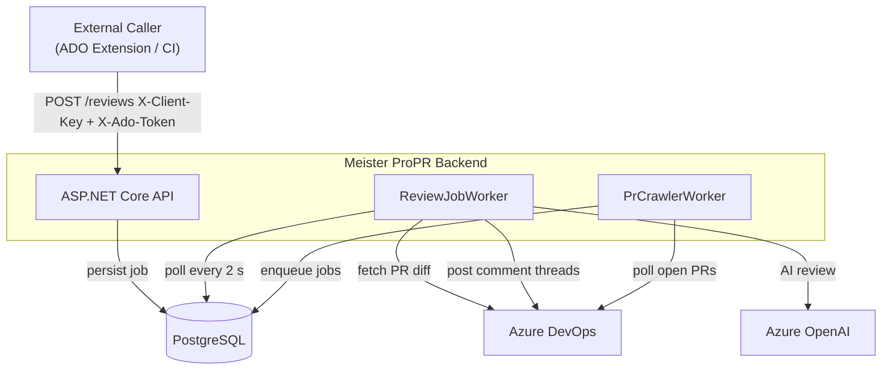

<p align="center">
  <h1 align="center">Meister ProPR</h1>
  <p align="center">AI-powered code review for Azure DevOps pull requests</p>
</p>

<p align="center">
  <a href="https://github.com/saenridanra/meister-propr/actions/workflows/ci.yml"></a>
  <a href="LICENSE"></a>
  
</p>

---

Meister ProPR is a self-hosted ASP.NET Core backend that watches Azure DevOps pull requests,
runs an AI review against them using Microsoft Foundry and the Microsoft Agent Framework, and posts the findings
back as threaded comments — anchored to the relevant file and line number.

---

## Features

- **AI review on demand** — POST a PR reference, get comments posted directly in ADO
- **Automatic crawling** — background worker polls for PRs assigned to a configured reviewer
- **Per-client Azure credentials** — each API client can use its own service principal or share the global backend identity
- **Job persistence** — review jobs survive restarts; idempotent submission prevents duplicate reviews
- **Prometheus metrics + OpenTelemetry traces** — production-ready observability out of the box
- **Docker-first** — Linux rootless container, env-var-only config, `docker compose up` to run

---

## How it works



The caller's `X-Ado-Token` is used **only** to verify that the caller has access to the ADO
organisation. All ADO operations (fetching PR content, posting comments) use a
**backend-controlled** Azure credential.

---

## Quick Start

```bash
# 1. Copy the example env file and fill in your values
cp .env.example .env   # or create .env manually (see docs/getting-started.md)

# 2. Start the API + PostgreSQL
docker compose up --build

# 3. Verify
curl http://localhost:8080/healthz
```

See [docs/getting-started.md](docs/getting-started.md) for Azure setup, service principal
configuration, per-client credentials, crawl configuration, and API usage examples.

---

## Tech Stack

| Layer          | Technology                                                        |
|----------------|-------------------------------------------------------------------|
| Runtime        | .NET 10 / ASP.NET Core MVC                                        |
| AI client      | `Microsoft.Extensions.AI` + Azure OpenAI Responses API           |
| ADO client     | `Microsoft.TeamFoundationServer.Client`                           |
| Auth           | `Azure.Identity` (`DefaultAzureCredential` / `ClientSecretCredential`) |
| Database       | PostgreSQL 17 via EF Core 10 + Npgsql                            |
| Logging        | Serilog (structured JSON in production)                           |
| Observability  | OpenTelemetry OTLP traces + Prometheus metrics                    |
| Tests          | xUnit + NSubstitute + `WebApplicationFactory`                     |
| Container      | Linux rootless (`mcr.microsoft.com/dotnet/aspnet:10.0`)          |

---

## Key Environment Variables

| Variable                | Required | Description                                                  |
|-------------------------|----------|--------------------------------------------------------------|
| `MEISTER_ADMIN_KEY`     | Yes      | Admin API key for client management (`X-Admin-Key` header)   |
| `MEISTER_CLIENT_KEYS`   | Yes*     | Comma-separated client keys (bootstrap seed in DB mode)      |
| `AI_ENDPOINT`           | Yes      | Azure OpenAI or AI Foundry endpoint URL                      |
| `AI_DEPLOYMENT`         | Yes      | Model deployment name, e.g. `gpt-4o`                         |
| `DB_CONNECTION_STRING`  | No       | PostgreSQL connection string; enables DB mode when set       |

\* In DB mode, client keys are managed via the `/clients` admin API.

Full variable reference: [docs/getting-started.md#environment-variables](docs/getting-started.md#environment-variables)

---

## Documentation

| Document | Description |
|---|---|
| [docs/getting-started.md](docs/getting-started.md) | Full setup guide: Azure, Docker, dotnet, API usage |
| [docs/architecture.md](docs/architecture.md) | Mermaid diagrams: request flow, data model, job states |

---

## Running Tests

```bash
dotnet test   # 235 tests — no Azure credentials or database required
```

---

## Demo Video

<a href="https://youtu.be/HFaO4oglM2s">
  
</a>

---

## License · Security · Contributing

- [AGPLv3 License](LICENSE) — free for individuals, home labs, and open-source projects; network use of modified
  versions requires source disclosure
- [Commercial License](COMMERCIAL.md) — for businesses that need proprietary modifications, SaaS rights, or professional
  support
- [Security Policy](SECURITY.md) — report vulnerabilities privately


